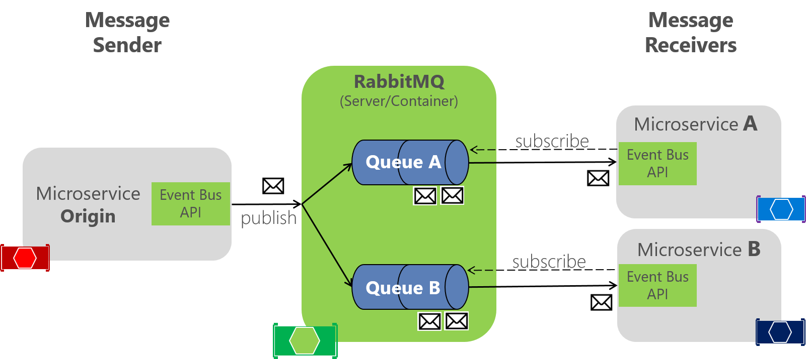

# Testando rabbitmq - Sem Framework

Conexão direta com amqp sem usar nenhum framework



> Referência: [Documentação](https://www.rabbitmq.com/tutorials/tutorial-three-javascript.html)

---

## Rodar o projeto

Requisitos:

- NodeJS V14+ [here](https://nodejs.org/en/download/)
- yarn [here](https://classic.yarnpkg.com/lang/en/docs/install/#debian-stable)
- docker [here](https://docs.docker.com/engine/install/ubuntu/)
- docker-compose [here](https://docs.docker.com/compose/install/)
- linux, wsl or mac
- build-essentials [here](https://linuxhint.com/install-build-essential-ubuntu/)

---

### Primeiros passos

Clone o projeto e exetute os passos

- Installar as dependências

```sh

    make install

```

- Iniciar o projeto

```sh

    make start

```

- Visualizar logs

```sh

    make logs

```

- Parar o projeto

```sh

    make stop

```

- Deletar apps

```sh

    make delete

```

Enviando dados para a routing-key-01

```sh

curl --location --request POST 'http://localhost:4000/1' \
--header 'Content-Type: application/json' \
--data-raw '{
    "some": "any data to route 1"
}'

```

Enviando dados para a routing-key-02

```sh

curl --location --request POST 'http://localhost:4000/2' \
--header 'Content-Type: application/json' \
--data-raw '{
    "some": "any data to route 2"
}'

```